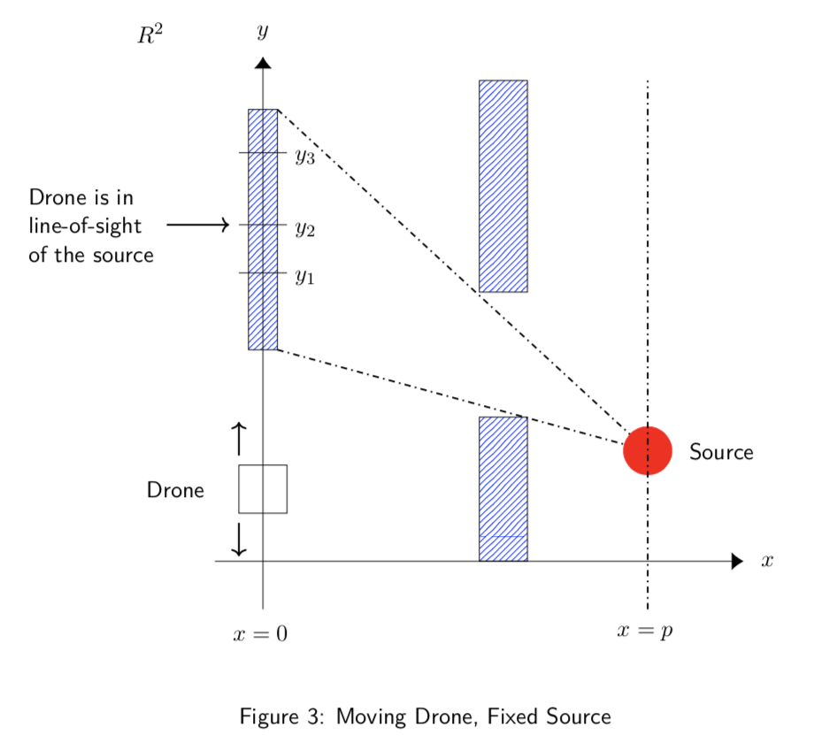
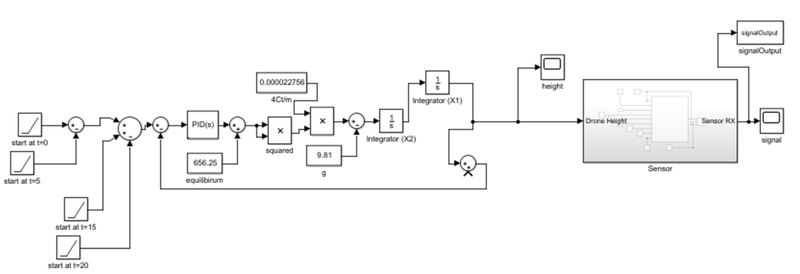

# Quadcopter Simulation

The goal of the project was to design a feedback control system to model a quadcopter's height using simulink.

A sensor was then added on top of this model to detect an object in a 2 dimensional coordinate system. The object emmited a noise contaminated signal which was processed by a moving average filter I designed to determine the location of the object.

